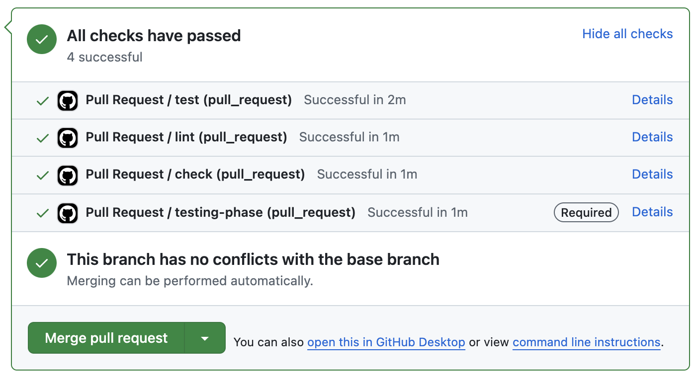

**Who decides your build is green?**  
Your CI config or the settings in your repo? I think it's better to have the config be the source of truth, and here's a quick tip on how.

## How does it work?

Your automated tests start like this:


In the screenshot above, we have a `lint` job and a `test` job, and they are both required to pass before the PR gets merged. But now we have a request to add static analysis as a `check` job. Maybe `check` runs some type checking so that our bundler doesn't have to.


Uh oh. We've added the `check` job in the CI, but it's not required. We don't have the right permissions to update the required tasks in the GitHub settings, so we have to put in a request or ask someone with admin privileges to make the change for us. Not a big deal, but we can do a little better.

We can move the responsibility of determining whether the overall testing phase is successful to the CI/CD pipeline rather than the repository settings. We do this by adding a job whose sole responsibility is to decide what it depends on and report whether they all succeeded.

In GitHub Actions, your config might look like this:

```yaml
jobs:
  test:
    steps:
      - run: yarn run test
  lint:
    steps:
      - run: yarn run lint
  check:
    steps:
      - run: yarn run check
  testing-phase:
    needs: [test, lint, check]
    steps:
      - run: echo "Testing phase successful"
```

Now, we can request that our only required job be `testing-phase` like this:



## What does this do for us?

1. We never have to request changes to the required jobs list in the GitHub settings again. We can simply add to the `needs` array in the actions config.
2. If we need to add a new job to the testing phase later, it can be required from the very beginning. This avoids forcing developers to pull the new required action in the CI config if an admin makes the new action required on the GitHub side.

## Conclusion

This approach scales with your automation by allowing the developer in charge of making changes to the CI config to control how the CI fails. The pattern is also repeatable for other phases, such as the build or deployment stages.
